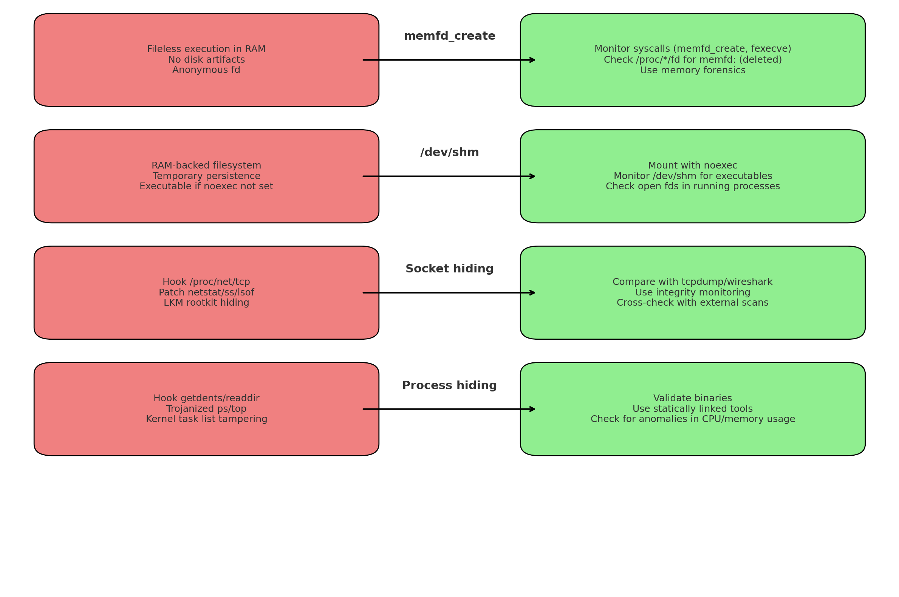

# Fileless & Memory-Backed Execution, Socket & Process Hiding  
**Attack vs Detection Guide**

Attackers sometimes avoid writing binaries to persistent disk by abusing
Linux features like `memfd_create`, memory-backed filesystems such as `/dev/shm`, or
kernel/userland hooking to hide processes and sockets.  
This makes traditional file-based scanning less effective.  
Below is a defender-focused guide showing how these techniques work and what to look for.

---

## 1. `memfd_create` Execution

| **Attack Technique** | **Description** | **Defensive Detection / Indicators** |
|-----------------------|-----------------|--------------------------------------|
| **Anonymous in-memory file** | `memfd_create()` creates a file descriptor backed only by RAM (not visible in the filesystem). Attackers write a payload into it. | Monitor syscalls (`memfd_create`) with `auditd`, `eBPF`, or seccomp. Unexpected processes creating memfds can be a red flag. |
| **Fileless execution** | Payload executed directly via `fexecve()` on the memfd handle, leaving no file on disk. | Look for `fexecve` calls shortly after `memfd_create`. Some EDR tools alert on this pattern. |
| **Stealth runtime presence** | In `/proc/<pid>/fd`, the handle appears as `memfd:<name> (deleted)`. | Inspect `/proc/<pid>/fd` and `/proc/<pid>/maps`. Entries like `memfd: (deleted)` often indicate hidden in-memory code. |
| **AV/EDR evasion** | No on-disk file = no hash to scan. | Use runtime memory scanners; correlate suspicious network activity with hidden processes. |
| **Living-off-the-land loaders** | Legitimate tools (e.g., `curl`, `wget`) download payloads and load them into memfd. | Correlate process ancestry (e.g., `curl` → `[memfd: (deleted)]`). Look for odd parent-child process chains. |

---

## 2. `/dev/shm` Execution

| **Attack Technique** | **Description** | **Defensive Detection / Indicators** |
|-----------------------|-----------------|--------------------------------------|
| **RAM-backed filesystem abuse** | `/dev/shm` is a `tmpfs` mount in RAM. Attackers drop binaries here to avoid persistent disk. | Monitor `/dev/shm` for unexpected files; use inotify or periodic scans. |
| **Temporary execution** | Binary remains only until deleted or rebooted. Less obvious than `/tmp`. | Unusual executables in `/dev/shm`; suspicious file permissions. |
| **Bypassing logging/scanning** | Many scanners ignore `tmpfs` areas like `/dev/shm`. | Configure security tools to include memory-backed filesystems. |
| **Persistence until reboot** | Files survive while the system is running (or until attacker removes them). | Check running processes for open file descriptors pointing into `/dev/shm`. |
| **Execution from shared memory** | If `/dev/shm` is mounted with `exec`, payloads can run directly from it. | Harden with mount option `noexec` on `/dev/shm` (if not required). |

---

## 3. Socket Hiding

| **Attack Technique** | **Description** | **Defensive Detection / Indicators** |
|-----------------------|-----------------|--------------------------------------|
| **Hooking `/proc/net/tcp`** | Attackers intercept reads from `/proc/net/tcp` or `/proc/net/udp` to hide ports. | Compare kernel socket state with raw packet capture (tcpdump/wireshark). |
| **Patching network tools** | Trojanized `netstat`, `ss`, or `lsof` omit certain connections. | Verify tool integrity (`rpm -V`, `debsums`). Run statically linked or known-good binaries. |
| **Kernel rootkits** | LKMs hook socket listing functions in kernel space. | Use integrity checkers (rkhunter, chkrootkit) and baseline kernel module monitoring. |
| **Userland LD_PRELOAD tricks** | Attackers hook libc calls to filter output from tools. | Inspect environment variables, monitor `/etc/ld.so.preload`. |

---

## 4. Process Hiding

| **Attack Technique** | **Description** | **Defensive Detection / Indicators** |
|-----------------------|-----------------|--------------------------------------|
| **Directory entry hooks** | Attackers hook `getdents`/`readdir` syscalls to hide `/proc/<pid>` entries. | Compare `/proc` with kernel task list or external scanners. |
| **Trojanized utilities** | Modified `ps`, `top`, `htop` skip malicious processes. | Validate checksums of binaries; use statically linked, trusted versions. |
| **Kernel-level task hiding** | Rootkits unlink processes from the kernel task list. | Use memory forensics (Volatility) or kernel integrity checking. |
| **Resource anomaly detection** | Hidden processes still consume CPU/memory. | Cross-check system load vs. visible processes. Suspicious gaps suggest hidden tasks. |

---

## 🔹 Defensive Best Practices

- **Audit system calls**  
  - Log `memfd_create` and `fexecve` usage with `auditd` or eBPF.  
  - Flag suspicious parent-child process chains.  

- **Monitor `/proc` and file descriptors**  
  - Inspect `/proc/*/fd` for `memfd: (deleted)` handles.  
  - Look at `/proc/*/maps` for memory-mapped anonymous executables.  

- **Harden memory-backed filesystems**  
  - Mount `/dev/shm` with `noexec,nosuid,nodev` where possible.  
  - Periodically scan `/dev/shm`, `/run`, `/tmp` for binaries.  

- **Cross-verify system tools**  
  - Use known-good copies of `ps`, `netstat`, `lsof`.  
  - Detect tampering with integrity verification tools.  

- **Use runtime memory forensics**  
  - Tools like Volatility or LiME can capture in-RAM payloads.  
  - Compare external scans (e.g., `nmap`) with local tools (`ss`, `lsof`) to spot hidden sockets.  

---

## 📊 Visual Overview

The diagram below summarizes attacker techniques vs. defender countermeasures:

*(Diagram generated: shows memfd_create, /dev/shm, socket hiding, process hiding, each linked with defenses.)*

---

## ✅ Key Takeaway
- `memfd_create` → *pure fileless execution, anonymous and hidden in RAM*.  
- `/dev/shm` → *RAM-backed file execution, temporary but still visible as files*.  
- **Socket & process hiding** → *rely on tampering with visibility, not absence*.  

Defenders can counter these with **syscall monitoring, filesystem hardening, tool integrity checks, and memory forensics**.
